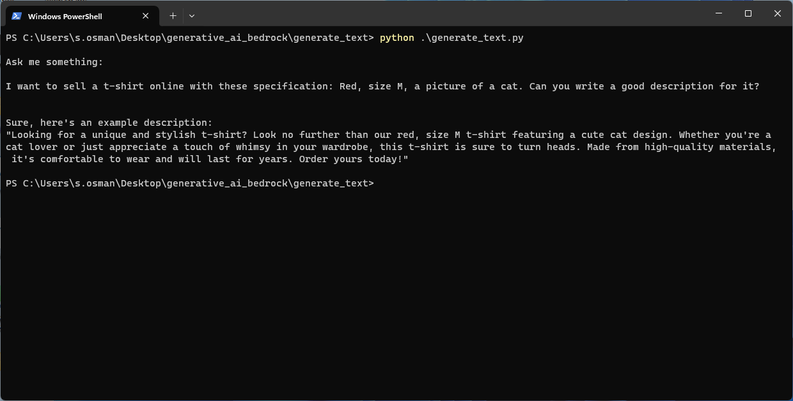
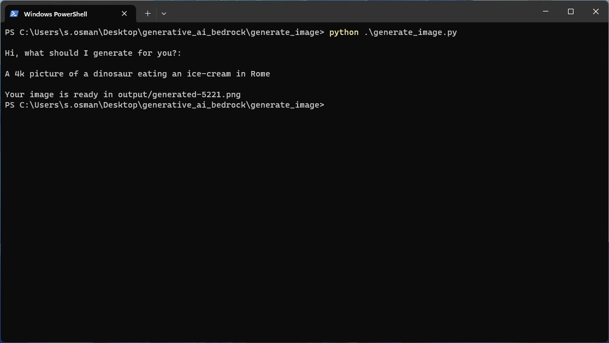

# Integration of Amazon Bedrock to generate text and images with python.

## Setup AWS CLI
In order to call the AWS Bedrock API from your application, you need first to login into your `AWS CLI`.
Install the AWS CLI, open a terminal and run `aws configure`. Provide `Access Key ID` and `Secret Access Key` (you find them in your personal area in your AWS Account) as follow:

```
$ aws configure
AWS Access Key ID [None]: THISXISXANYEXAMPLEYKEY
AWS Secret Access Key [None]: yhyzybbbbthisIsAnExampleSecretKey
Default region name [None]: us-east-1
Default output format [None]: json
```

### Subscription/Activation to AWS Bedrock
In order to use the AWS Service Bedrock you need to activate the service and enable the Model_AI provided.
See https://us-east-1.console.aws.amazon.com/bedrock/home?region=us-east-1#/ and https://us-east-1.console.aws.amazon.com/bedrock/home?region=us-east-1#/overview

### Pre-use
If you dont have it already, install python and boto3 (the AWS SDK for Python to create, configure, and manage AWS services).
The Command to install it is: 
```
pip install boto3
```
Now open your terminal and clone this repository:
```
git clone https://github.com/samer955/generative_ai_bedrock.git
```


### Starting the generate-text App
1. Navigate inside the folder `./generative_ai_bedrock/generate_text`
2. Run `python generate_text.py`
3. Provide a question and wait for an answer in your terminal.




### Starting the generate-image App

1. Navigate inside the folder `./generative_ai_bedrock/generate_image`
2. Run `python generate_image.py`
3. Provide the information required to generate your image and wait the process to end. The image will be available in `./generate_image/ouput/`



We asked the AI-model to generate a dinosaur eating an Ice-cream in Rome and this is the result: 


